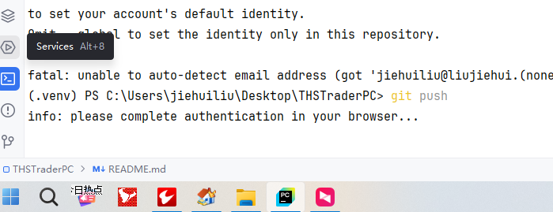
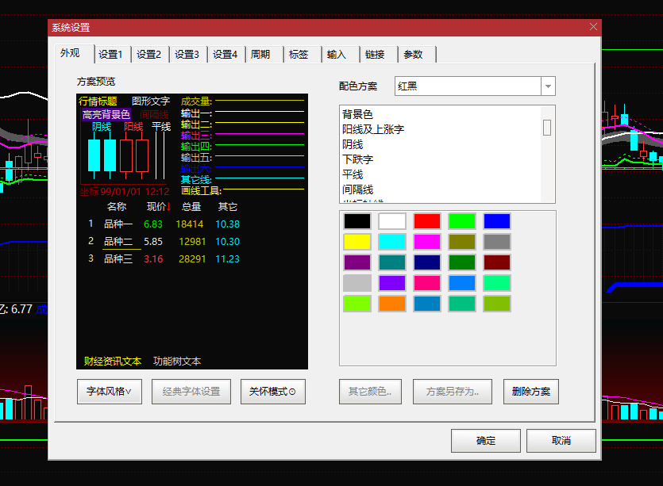

# 安装过程遇到问题
1、要用python3.8版本，这个版本才能安装easyocr，向系统环境添加路径
2、windows安装tesseract，安装完成向系统环境添加路径
参考：https://blog.csdn.net/weixin_53660567/article/details/123664015
3、向C:\Program Files\Tesseract-OCR\tessdata目录下拷贝下载下来的data文件
文件来自https://github.com/tesseract-ocr/tessdata

如果执行购买、售卖程序点击购买售卖按钮失效时，修改jquarder底层源码，执行两次点击操作

# 系统调整
- 调整系统显示比例为100%
- 打开同花顺网上交易系统最大窗口展示
- 打开通达信，拖拽至第二个图标位置
- 
- 调整通达信字体： ctl+d，字体风格-》现代，启动关怀模式，
- 
- 调整到日线图，主升浪指标

